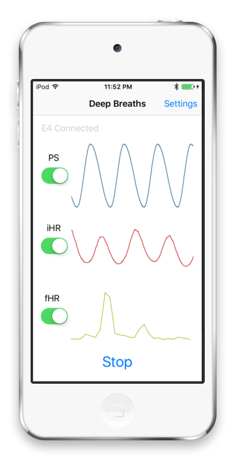

This HRV biofeedback device uses an Empatica E4 to detect individual heartbeats. It shows a breathing pacing signal, instant heart rate, and a frequency analysis of instant heart rate (breathing rate when breathing with a slow, even pattern). Even without an E4, the app will display the pacing signal.

The heartbeat detection algorithm is explained in [this paper](https://psi.engr.tamu.edu/wp-content/uploads/2018/01/hair2017acii.pdf).

Information on the Empatica E4 API can be found [here](http://developer.empatica.com).
